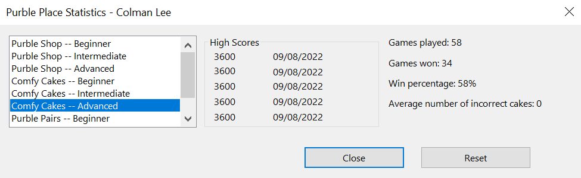
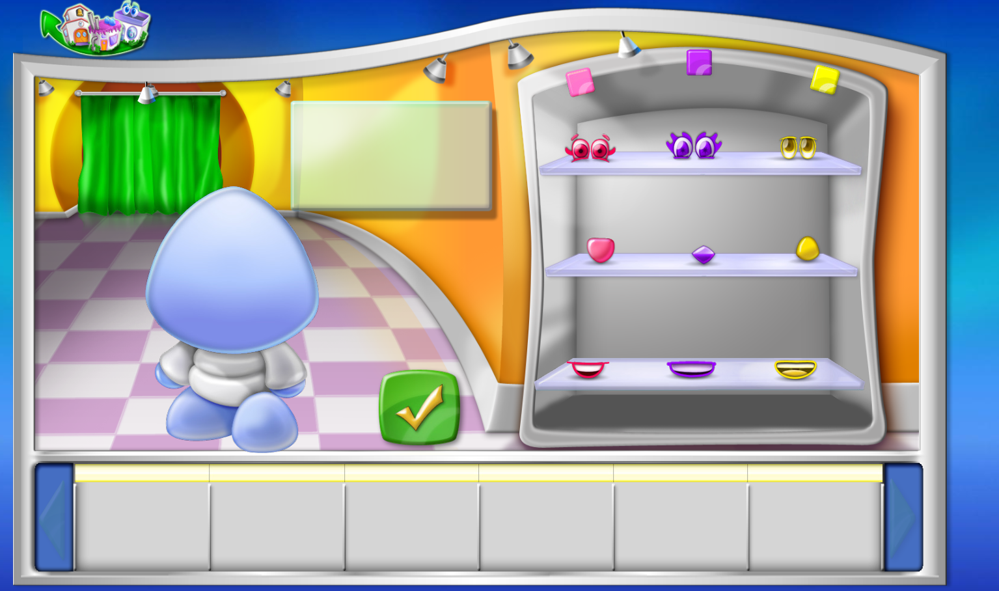
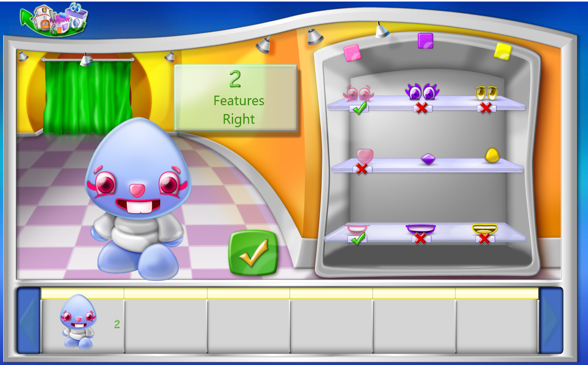
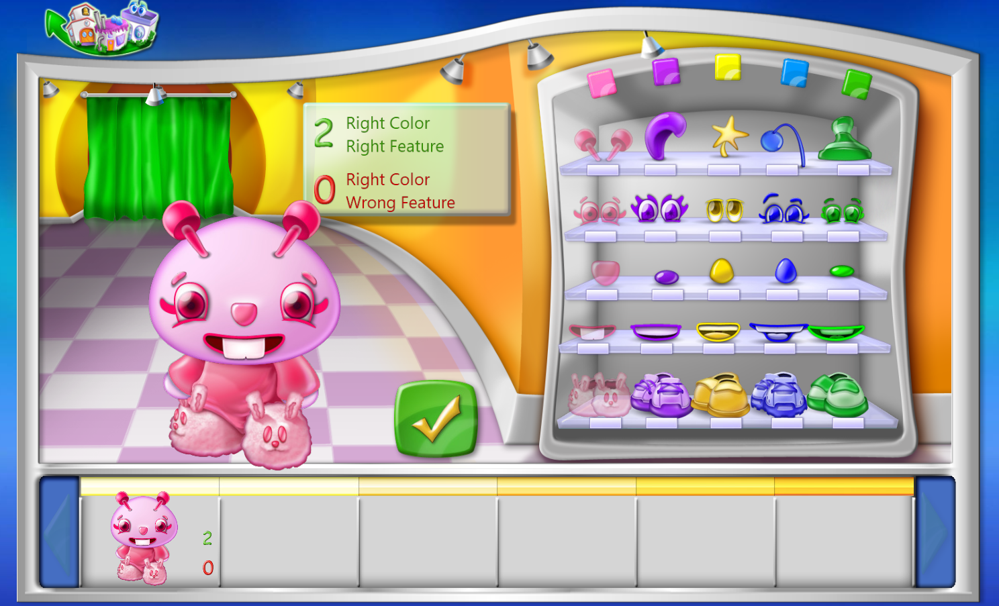
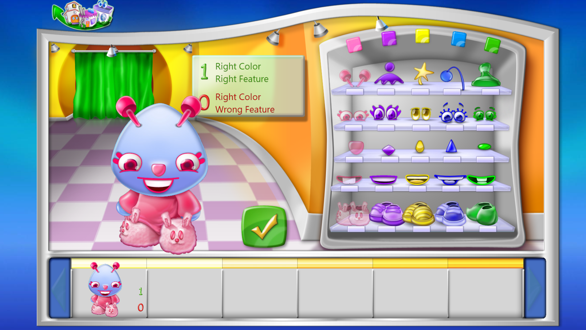
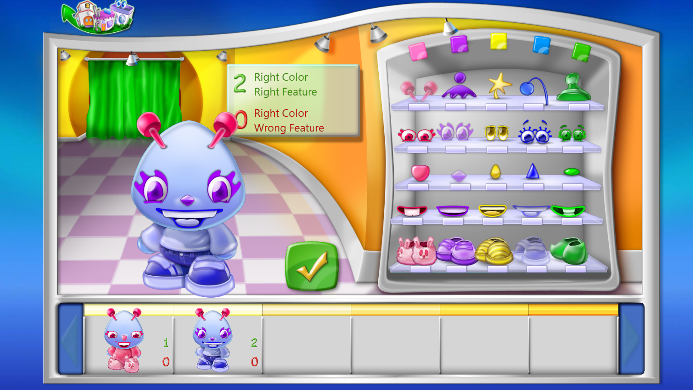
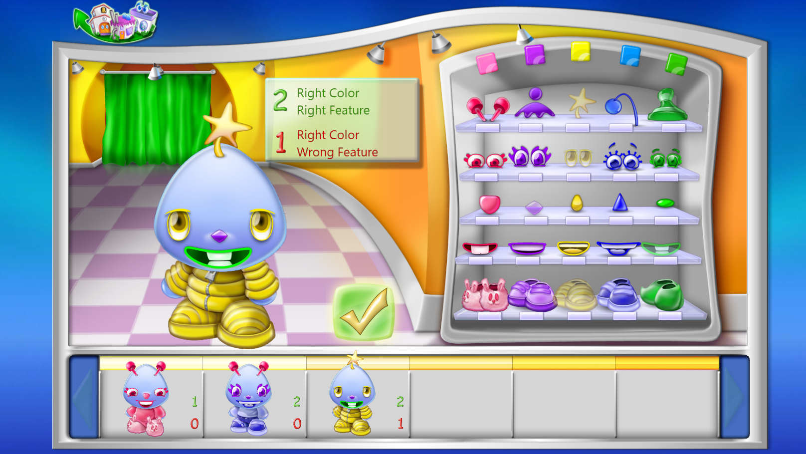
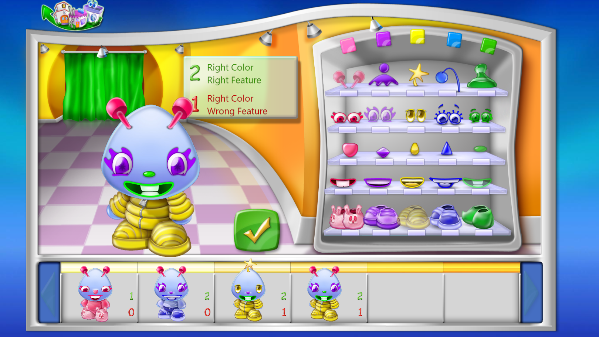
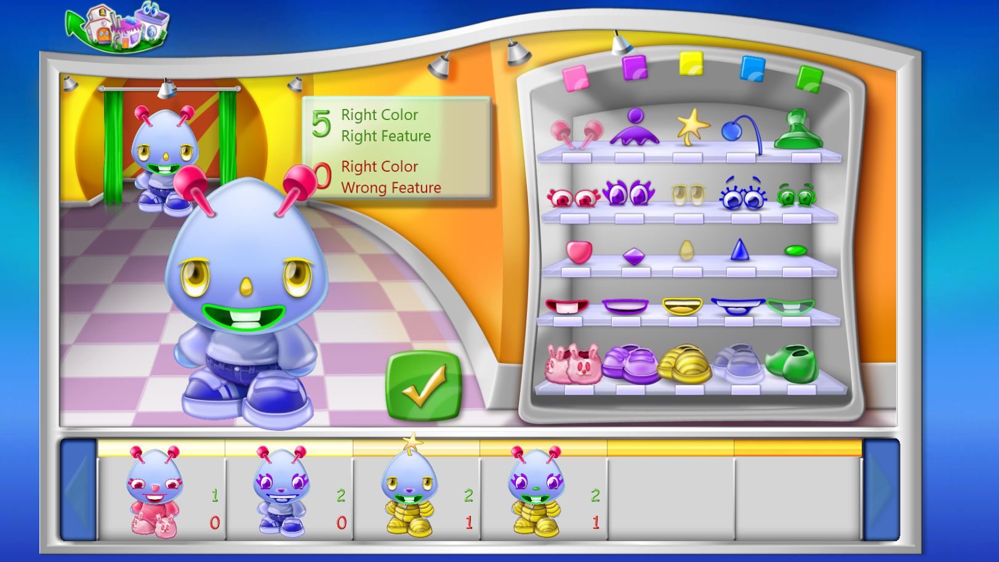

# Purble Shop Solver

## Table of Content
1. [Introduction](#introduction)
2. [How to play](#how-to-play)
4. [Solver instruction](#solver-instruction)
3. [Approach](#approach)
5. [Analysis](#analysis)
    - [Expectation analysis](#expectation-analysis)
    - [Variance analysis](#variance-analysis)
6. [Coding](#coding)
    - [Preliminary](#preliminary)
    - [Geometric beauty of score matrices](#geometric-beauty-of-score-matrices)
    - [Pseudocode](#pseudocode)
7. [Conclusion](#conclusion)

## Introduction
Hey, you! Remember Purble Place?


Of course you do. Everyone knows this. 

Recently, a sudden wave of nostalgia commanded me to download Purble Place, and I had a few <sup>*(too many)*</sup> games on Comfy Cake. 



Not to brag, but I'm pretty good at it.

My confidence persuaded me into trying my luck at Purble Shop, and it didn't take long for me to realise I was ***terrible*** at it. Like ***really terrible***. So I did what most people would do in my situation:

<p align=center>
    
</p>

And it is quite successful. 
## How to play
If you haven't played Purble Shop before, you are still very welcome here *(albeit less welcome)* and here is how to play the game. Skip to [solver instruction](#solver-instruction) section if you know how to play already. 

There are three difficulties: beginner, intermediate, and advanced. Let's use the beginner difficulty to illustrate what's going on. 

When you start the game, you are greeted with this interface. 

<p align=center>
    
</p>

In the wardrobe, there are three features (eyes, nose, and mouth), and for each feature there are three colours (red, purble, yellow). The goal of this game is to guess the correct set of features of this blue butt-plug-looking creature. No offense. 

But how do we know what the correct set of features is?

Answer:
### We guess!
<br>

After picking a set of features (here I picked red eyes, red nose, and red mouth), the game tells you how many features you got right. 

<p align=center>
    
</p>

In this case, we got two features right. Since this is the beginner difficulty, the game is very generous in telling us which specific features we got right. 

We have seven tries in total to guess. 

In intermediate difficulty, there are four features in total and four colours for each features. And we are not given which specific features we got right. Only the number of right features are given. 

In advanced difficulty, there are five features in total and five colours for each features. However, we are given one extra piece of information besides the number of right features: the number of ***right colour***, but ***wrong feature***. 

<p align=center>
    
</p>

It's a very simple game, but it requires a heightened sense of logic. 

## Solver instruction
There are two solvers:
- [intermediate difficulty solver](solver_intermediate.py)
- [advanced difficulty solver](solver_advanced.py)

The solvers run on Python and take in standard inputs. Below are the steps on running them in your local machine
1. Download solvers ([intermediate difficulty solver](solver_intermediate.py), [advanced difficulty solver](solver_advanced.py))
2. Install required package ([NumPy](https://numpy.org/doc/)) into your environment

    ```
    > pip install numpy
    ```
3. Change to your directory with the downloaded solver files and run the solver of your choice
    ```
    > python solver_advanced.py
    ```
4. Follow the instruction given

Here is an example of how an advanced game goes using the advanced difficulty solver. Before the game starts, you enter the colour symbols.  You might want to use short symbols like initial letter of colour or numbers, but for illustration purposes, I'll just use the colour name in full. 

```
Enter colour symbols

Colour 1: red
Colour 2: purple
Colour 3: yellow
Colour 4: blue
Colour 5: green
```

From here on out, you input the features you guessed and their corresponding results in the game into the terminal. Some useful information will be printed and you decide which features to guess. Rinse and repeat.

For my first guess, I'll guess red, red, red, red, and red. It really doesn't matter what your first guess is. 

<p align=center>
    
</p>

1 right colour right feature, and 0 right colour wrong features. Let the solver know that:
```
Feature vector guessed: red red red red red
Number of right colour right features: 1
Number of right colour wrong features: 0

Most probable guesses
'blue red blue yellow blue'   ----   0.078125%
'blue red blue yellow yellow'   ----   0.078125%
'blue red blue yellow green'   ----   0.078125%
'blue red blue yellow purple'   ----   0.078125%
'red green blue blue yellow'   ----   0.078125%

Recommend trying the combination 'red purple purple blue blue' since it provides the most expected information
```
Even the best guess has only a 0.078125% chance of being correct. So let's try getting more information by using the solver's suggestion in the game:

<p align=center>
    
</p>

Let the solver know that:
```
Feature vector guessed: red purple purple blue blue
Number of right colour right feature: 2
Number of right colour wrong features: 0

Most probable guesses
'red green green blue green'   ----   3.125%
'red yellow green green blue'   ----   3.125%
'red yellow green blue green'   ----   3.125%
'red green green green blue'   ----   3.125%
'red yellow purple green green'   ----   3.125%

Recommend trying the combination 'yellow yellow purple green yellow' since it provides the most expected information
```
Again, let's try the suggestion. 

<p align=center>
    
</p>

```
Feature vector guessed: red purple purple blue blue
Number of right colour right feature: 2
Number of right colour wrong features: 0

Most probable guesses
'red purple green green yellow'   ----   25.0%
'red yellow yellow green blue'   ----   25.0%
'red yellow yellow blue yellow'   ----   25.0%
'red yellow green blue yellow'   ----   25.0%
'purple blue purple purple green'   ----   0.0%

Recommend trying the combination 'red purple green green yellow' since it provides the most expected information
```
The solver has narrowed it to only **4** choices! Let's hope this is the final guess...

<p align=center>
    
</p>

Ooh! Not quite right! But after entering our guess into our terminal, 

```
Feature vector guessed: red purple green green yellow
Number of right colour right feature: 2
Number of right colour wrong features: 1

Most probable guesses
'red yellow yellow green blue'   ----   100.0%
'purple blue purple blue purple'   ----   0.0%
'purple blue purple blue yellow'   ----   0.0%
'green green green green green'   ----   0.0%
'purple blue purple blue blue'   ----   0.0%

Recommend trying the combination 'red yellow yellow green blue' since it provides the most expected information
```
We've got the answer! Now, let's see if it works!

<p align=center>
    
</p>

Yep! It works! And it only took us 5 tries! 
```
Feature vector guessed: red yellow yellow green blue
Number of right colour right features: 5
Number of right colour wrong features: 0

Congratulations! You are correct on your 5th guess.
```

## Approach

Perhaps counter-intuitive, but you should not guess the set of features you think is the most likely to be right. Instead, we should eliminate as many sets of features based on give information. In other words, we are maximising the ***amount of information*** we will obtain for each guess. In fact, maximising the probability of being right results in a poorer performance (see [analysis](#analysis) section). 

When I first started approaching this problem mathematically, I was immediately reminded of <a href="https://www.youtube.com/watch?v=v68zYyaEmEA&t=601s">3Blue1Brown's video</a> on solving <a href="https://www.nytimes.com/games/wordle/index.html">Wordle</a>. This approach uses extremely similar idea, so I recommend watching his video for more information (and nicer graphic too!). 

## Analysis

### Expectation analysis

Since the solver is deterministic, i.e. given the same guesses it will always give the same recommendation, we can easily analyse its performance by going through every single possible feature combination and count how many guesses are needed. 

<br></br>

Table 1: Expected number of guesses of solvers for intermediate and advanced difficulty level with different approaches

|Maximising                    |Intermediate|Advanced|
|------------------------------|:----------:|:------:|
|Expected amount of information|    5.11    |  4.95  |
|Probability of being right    |    5.19    |  4.98  |

<br></br>

In both levels, the solver with the approach of maximising **expected amount of information** performs better than maximising **probability of being right**. Well, by a little bit. 

One very surprising observation is that on average, the solvers for the advanced level get the right combination quicker than the intermediate level, in ***less than five guesses***! This is because we are provided extra information (the number of right colour wrong features) in advanced level after each guess. In fact, this distinction between the two levels affects the...

### Variance analysis

Let's go back to the intermediate solver for a second. 

<br></br>

<p align=center>
    
</p>
<p align=center>
    Figure 2: Frequency graph of number of guesses with intermediate level solver; maximising amount of information
</p>

<br></br>

From figure 2, we see the solver maximising amount of information succeeded in finding the correct four-feature-four-colour combination in at most 7 tries. In particular, the combinations: 

`['c', 'd', 'b', 'c']`
<br>
`['c', 'd', 'c', 'a']`
<br>
`['d', 'd', 'c', 'b']`

where `'a'`, `'b'`, `'c'`, and `'d'` symbolise the four colours in order, take 7 guesses to get right. 

However, if the approach of maximising probability of being right is used, it could take up to ***10*** guesses to get it right! (See below figure 3)

<br></br>

<p align=center>
    
</p>
<p align=center>
    Figure 3: Frequency graph of number of guesses with intermediate level solver; maximising probability of being right
</p>

<br></br>

Although from previous [expectation analysis](#expectation-analysis) section we saw that the number of guesses needed on average is fairly similar using the two different approaches, we also want the solver to behave stably. So this is why we are interested in the variance. Remember:

> A lower variance corresponds to a stabler solver.

And here's the table of variance. 

<br></br>

Table 4: Variance of number of guesses of solvers for intermediate and advanced difficulty level with different approaches

|Maximising                    |Intermediate|Advanced|
|------------------------------|:----------:|:------:|
|Expected amount of information|    0.89    |  0.38  |
|Probability of being right    |    1.46    |  0.53  |

<br></br>

As inferred from figure 2 and figure 3, there is a significant difference in variance between the two approaches for the intermediate level solver. 

For the advanced one, there is still a sizable difference, but definitely not as much. Perhaps it would be more intuitive to simply show you the guess frequency graphs. 

<br></br>

<p align=center>
    
</p>
<p align=center>
    Figure 5: Frequency graph of number of guesses with advanced level solver; maximising amount of information
</p>

<br></br>

<p align=center>
    
</p>
<p align=center>
    Figure 6: Frequency graph of number of guesses with advanced level solver; maximising probability of being right
</p>

<br></br>

Honestly, not too different! The reason for that is because we are given an additional information in advanced level after each guess: 

>The number of right colour wrong features

Just this one little extra piece of information significantly reduce the difference in variance! 

In fact, if we're not given this piece of information, we obtain a variance of **0.99** with the approach of maximising expected information and **1.39** with the approach of maximising probability of being right. 

See below graphical representations of the number of guesses required if the number of right colour wrong features is not given after each guess. 

<br></br>

<p align=center>
    
</p>
<p align=center>
    Figure 7: Frequency graph of number of guesses with advanced level solver; missing right colour wrong feature; maximising probability of being right
</p>

<br></br>

<p align=center>
    
</p>
<p align=center>
    Figure 8: Frequency graph of number of guesses with advanced level solver; missing right colour wrong feature; maximising probability of being right
</p>

<br></br>

This could be due to the fact we are actually conditioning on one more random variable, which leads to a narrower distribution. Further research is required. 

## Coding

This section discusses how the algorithm works and how the code is implemented. 

Let's start off with the preliminary. 

### Preliminary

Here are some useful definitions before jumping into the pseudocode. 

For intermediate level, we have

$C:=\{ \text{'1', '2', '3', '4'} \}$, where `'1'`, `'2'`, `'3'`, and `'4'` denote the four colours. 

##### *(These colour symbols do not have to be numbers and can be whatever the user wants. Numbers are chosen only because they look nicer.)*

$\mathbf{V}:=$ all combinations $\in \text{M}_{256\times4}(C)$ such that $\mathbf{V}[i,:]$ is the $i$<sup>th</sup> combination (feature vector). 

##### Note: feature vectors are vectors $\in C^4$ where each entry denotes the corresponding colour at that specific feature location. 

<p align=center>
    
</p>

$V_{pos}:=$ the set of possible combinations given guess results, and is $C^4$ initially. 

$\mathbf{M}_{rcrf}:= (m_{ij}) \in \text{M}_{256\times256}(\{0,1,...,4\})$ where $m_{ij}$ is the number of right colour right features when $\mathbf{V}[i,:]$ is the true feature vector and $\mathbf{V}[j,:]$ is the guess feature vector. 

##### Note: Number of right colour right features is the same when the true feature vector is swapped with the guess feature vector, i.e. $m_{ij} = m_{ji}$ for $i, j = 1,2,...,256$. $\mathbf{M}_{rcrf}$ is symmetric follows. 

<p align=center>
    
</p>

##### e.g. there is 1 right colour right feature when true vector vector is the 256th feature vector `['4', '4', '4', '4']` and the guess vector is the 4th `['1', '1', '1', '4']`. 

For advanced level, $C$, $\mathbf{V}$, $V_{pos}$, and $\mathbf{M}_{rcrf}$ are defined similarly, with

$C:=\{ \text{'1', '2', '3', '4', '5'} \}$

$\mathbf{V}:=$ all combinations $\in \text{M}_{3125\times5}(C)$ such that $\mathbf{V}[i,:]$ is the $i$<sup>th</sup> feature vector. 

$V_{pos}:=$ the set of possible combinations given guess results, and is $C^5$ initially. 

$\mathbf{M}_{rcrf}:= (m_{ij}) \in \text{M}_{3125\times3125}(\{0,1,...,5\})$ where $m_{ij}$ is the number of **right colour right features** when $\mathbf{V}[i,:]$ is the true feature vector and $\mathbf{V}[j,:]$ is the guess feature vector. 

<p align=center>
    
</p>

Additionally, we define

$\mathbf{M}_{rcwf}:= (m_{ij}) \in \text{M}_{3125\times3125}(\{0,1,...,5\})$ where $m_{ij}$ is the number of **right colour wrong features** when $\mathbf{V}[i,:]$ is the true feature vector and $\mathbf{V}[j,:]$ is the guess feature vector. 

<br></br>

The reason why defined the right-colour-right-feature matrix $\mathbf{M}_{rcrf}$ and the right-colour-wrong-feature matrix $\mathbf{M}_{rcwf}$ is because we can simply look up rcrf or rcwf scores in the pre-calculated matrices, which improves computation speed significantly. 

With everything defined, we may move onto the [pseudocode](#pseudocode). However, I would like to go on a little tangent on the geometric beauty of the rcrf and rcwf matrices.

### Geometric beauty of score matrices

The indexing of feature vectors is conveniently glossed over in the definitions because the order in which the feature vectors are indexed does not affect any of the coding (provided the indices remain the same as the algorithm runs, of course). However, it does play an important role in the visualisation of the two score matrices. 

For this reason, I will explicitly state how feature vectors are indexed. 

In intermediate level difficulty, there are $4^4=256$ feature vectors in total. For each index $i=1,2,...,256$, we first subtract 1 (which will become apparent why) then express it in base 4. 

e.g. For $i=28$, we have $i-1=27=(0123)_4$

In base 4, there are 4 values: 0, 1, 2, 3. Obviously. And now, let's say if accordingly from 0 to 3, we use them to represent each of the colour. Then $27=(0123)_4$ corresponds to the feature vector `['1', '2', '3', '4']`. 

We have found a way to index the feature vectors! 

Here are some examples of converting indices into feature vectors:

$i=1$: $i-1=0=(0000)_4$, corresponds to feature vector `['1', '1', '1', '1']`

$i=256$: $i-1=255=(3333)_4$, corresponds to feature vector `['4', '4', '4', '4']`

$i=35$: $i-1=34=(0202)_4$, corresponds to feature vector `['1', '3', '1', '3']`

$i=229$: $i-1=228=(3210)_4$, corresponds to feature vector `['4', '3', '2', '1']`

Using this index convention, let's take a look at the heatmap of the intermediate level rcrf matrix (figure 9). 

<br></br>

<p align=center>
    
</p>
<p align=center>
    Figure 9: Heatmap of rcrf matrix; intermediate level
</p>

<br></br>

It is fascinating how simply by matching digits between two numbers (in base 4 in our case) can result in such a astonishingly beautiful matrix. 

It has the magical property that all right-diagonal entries are identical to each other!

The rcrf matrix in advanced level also displays such property. See below figure 10. 

<br></br>

<p align=center>
    
</p>
<p align=center>
    Figure 10: Heatmap of rcrf matrix; intermediate level
</p>

<br></br>

What about the rcwf matrix? Remember, right colour wrong features do not include right colour right features, so we might not get something so diagonal. Figure 11 shows the heatmap of the rcwf matrix in advanced level. 

<br></br>

<p align=center>
    
</p>
<p align=center>
    Figure 11: Heatmap of rcwf matrix; intermediate level
</p>

This is extraordinary. I admit to have spent minutes just staring at this heatmap, admiring its beauty. As expected, it loses its magical "right-diagonal" property. 

It is unbelievable that such a pretty and intricately-patterned matrix is generated simply by comparing digits between numbers. 

Who would've guessed that a simple game of Purble Shop would lead us to the field of number systems?

<br></br>

### Pseudocode

<p>
    
    
</p>

## Conclusion

This has been extremely rewarding for me, and I hope it is for you as well (if you managed to stay for that long). 

I originally just wanted to make a simple bot which solve Purble Shop for me so I can flex to my friends, but the journey to getting there and putting it on GitHub is far from simple. 

From coding standard inputs in Python to writing git, from learning Shannon entropy to researching about number systems, this journey took me to places I never expected. And I am very grateful for that. 

This is the end of my 2022 personal project on solving Purble Shop. Thank you! 